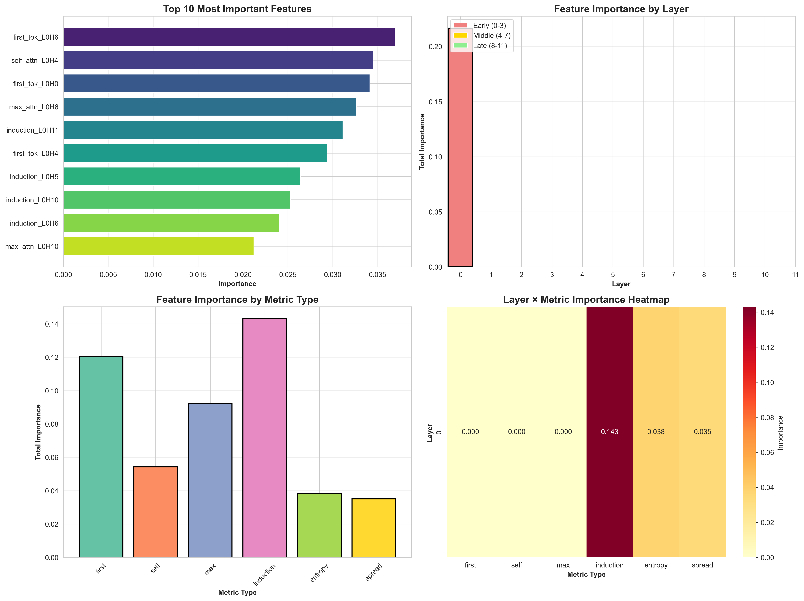
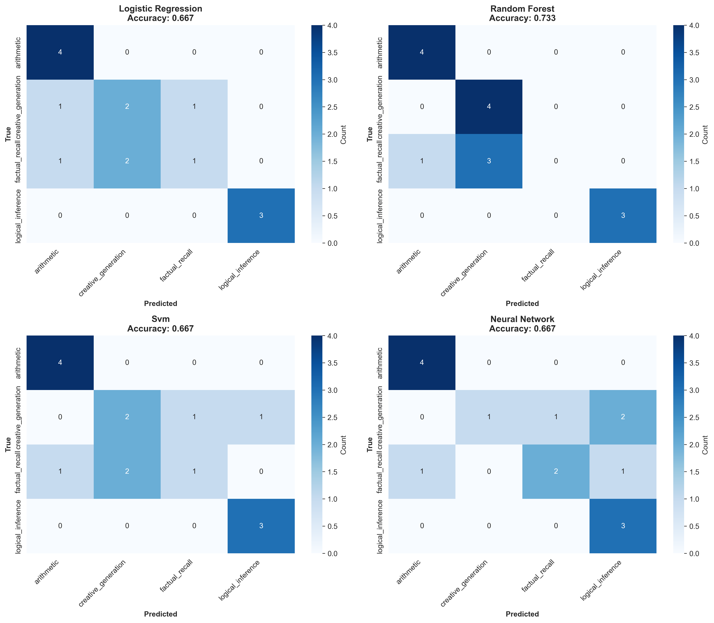
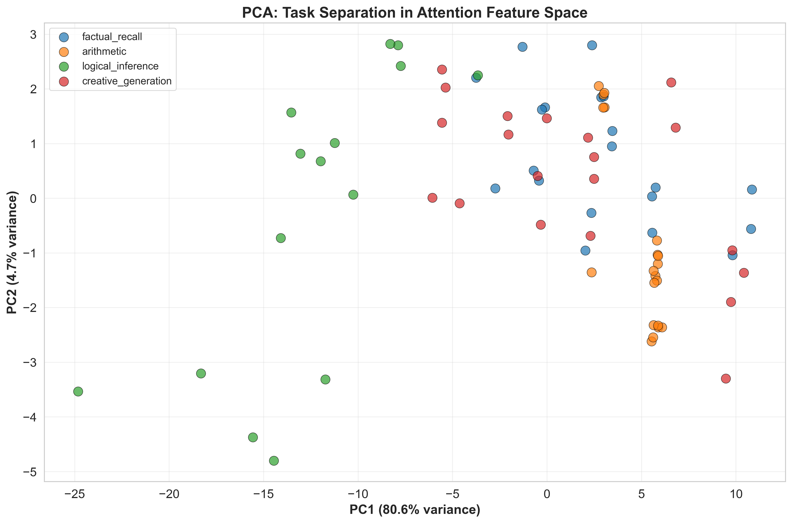

# LLM Attention Pattern Analysis

An investigation into whether transformer attention patterns encode cognitive task-type information — and where in the network that signal lives. Developed as an independent research inquiry within graduate studies at Luleå University of Technology (D7054E, 2026).

## Key Finding

Contrary to the hypothesis that later layers show more task-specific patterns, **Layer 0 features dominated task-type classification** across all four cognitive categories. Random Forest classification achieved **73.33% accuracy** (vs 25% random baseline) using attention features from GPT-2-small.



| Layer Range | Feature Importance | % of Top 20 Features |
|-------------|-------------------|----------------------|
| Early (0–3) | 0.2165 | **100%** |
| Middle (4–7) | 0.0000 | 0% |
| Late (8–11) | 0.0000 | 0% |

Layer 0, Head 11's induction score was the single most discriminative feature, sharply differentiating arithmetic tasks (induction 0.31) from logical inference (0.14).

This finding was independently replicated in a separate study on Llama 3 8B (73.3% accuracy on NL-to-SQL task classification), suggesting **Layer 0 task encoding may be a structural property of transformer attention independent of scale** — consistent across a 68x difference in model size.

## Classification Results



| Model | Test Accuracy | CV Mean | F1-Score |
|-------|--------------|---------|----------|
| Random Forest | **73.33%** | 68.33% | **0.72** |
| Logistic Regression | 66.67% | 80.00% | 0.65 |
| SVM | 66.67% | 68.33% | 0.64 |
| Neural Network | 66.67% | 63.33% | 0.65 |
| Random Baseline | 25.00% | — | 0.25 |

Most errors occurred between factual recall and creative generation — consistent with their shared declarative surface structure. Arithmetic and logical inference were rarely confused with other categories.

## Task Separation in Attention Feature Space



PCA of the 864-feature attention space shows logical inference separating distinctly along PC1 (80.6% variance explained), with arithmetic clustering separately. The partial overlap of factual recall and creative generation is consistent with their classification confusion.

## Hypotheses

| Hypothesis | Result |
|------------|--------|
| H1: Tasks produce statistically different attention patterns | ✓ Supported — ANOVA p < 0.001, η² > 0.6 across all metrics |
| H2: Later layers show more task-specific patterns | ✗ Rejected — Layer 0 dominated entirely |
| H3: Entropy correlates with task uncertainty | ~ Partially supported — logical inference highest (1.32), full ordering not observed |
| H4: Task type predictable with >70% accuracy | ✓ Supported — Random Forest achieved 73.33% |

## Method

- **Model:** GPT-2-small (117M parameters, 12 layers, 12 heads)
- **Library:** TransformerLens for attention extraction
- **Dataset:** 75 prompts across four cognitive task categories
- **Features:** 6 attention metrics × 144 heads = 864 features per sample
- **Evaluation:** 5-fold stratified cross-validation + held-out test set

### Task categories
- **Factual recall** (20 prompts) — e.g. "The capital of France is"
- **Arithmetic reasoning** (20 prompts) — e.g. "15 + 27 ="
- **Logical inference** (15 prompts) — e.g. "If all dogs are mammals and Rex is a dog, then Rex is a"
- **Creative generation** (20 prompts) — e.g. "Once upon a time in a magical forest,"

### Attention metrics extracted per head
- Entropy (attention focus vs diffusion)
- Induction score (pattern-copying behaviour)
- Self-attention (diagonal attention weights)
- First-token attention (BOS token attention)
- Spread (standard deviation of attention weights)
- Max attention (mean of maximum weight per position)

## Setup

```bash
python -m venv llm_env
source llm_env/bin/activate  # On Windows: llm_env\Scripts\activate
pip install transformer-lens torch pandas numpy matplotlib seaborn scikit-learn scipy tqdm
```

## Running the Pipeline

```bash
python src/build_dataset.py         # Build prompt dataset and extract attention features
python src/statistical_analysis.py  # Run hypothesis tests (H1–H3)
python src/train_models.py          # Train classifiers and evaluate (H4)
python src/generate_final_report.py # Generate summary report
```

## Repository Structure

```
.
├── data/
│   ├── raw/
│   │   └── task_prompts.json          # 75 prompts across 4 task categories
│   └── processed/
│       └── attention_dataset.csv      # 75 × 867 feature matrix
├── src/
│   ├── data_collection.py             # Prompt curation
│   ├── attention_extraction.py        # TransformerLens hook extraction
│   ├── build_dataset.py               # End-to-end dataset builder
│   ├── statistical_analysis.py        # ANOVA, pairwise tests (H1–H3)
│   ├── train_models.py                # RF, LR, SVM, MLP classifiers (H4)
│   └── generate_final_report.py       # Result aggregation
└── results/
    ├── visualizations/                # All plots: attention heatmaps, confusion matrices,
                                       # feature importance, PCA, entropy distributions
```

## Limitations and Future Work

- Small dataset (75 prompts) limits statistical power — results should be validated at 500+ samples per task
- Single model family (GPT-2-small) — replication across BERT, LLaMA, and instruction-tuned variants needed
- Layer 0 dominance may reflect surface syntactic patterns rather than deep task encoding — future work should use syntactically similar but semantically distinct tasks to distinguish these hypotheses
- Correlational findings only — causal confirmation requires ablation studies and activation patching

## References

- Vaswani et al. (2017). Attention Is All You Need
- Elhage et al. (2021). A Mathematical Framework for Transformer Circuits
- Nanda et al. (2022). TransformerLens. https://transformerlensorg.github.io/TransformerLens/